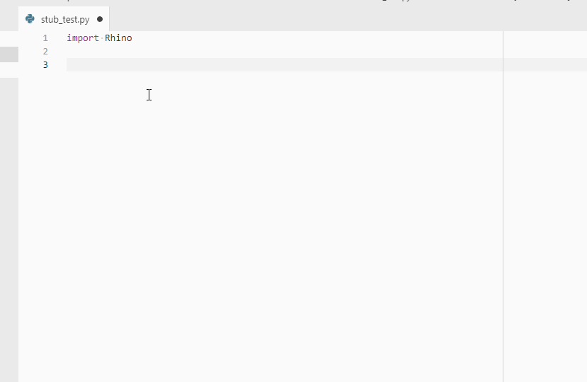
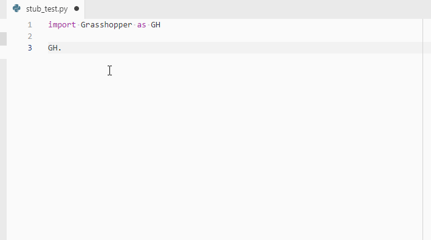

# McNeel python stubs

Python stubs for .NET assemblies that ship with Rhino. Specifically
- RhinoCommon (https://pypi.org/project/Rhino-stubs/)
- Eto (https://pypi.org/project/Eto-stubs/)
- Grasshopper (https://pypi.org/project/Grasshopper-stubs/)
- GH_IO (https://pypi.org/project/GH-IO-stubs/)
- GH_Util (https://pypi.org/project/GH-Util-stubs/)

See the following posts for details about the purpose of these packages:

- [Autocomplete while editing python scripts outside of Rhino](https://discourse.mcneel.com/t/autocomplete-while-editing-python-scripts-outside-of-rhino/79329) on Rhino forums
- [Autocomplete and Type Hints with Python Scripts for Rhino/Grasshopper](
https://stevebaer.wordpress.com/2019/02/25/autocomplete-and-type-hints-with-python-scripts-for-rhino-grasshopper) on Steve Baer's Notes

## Using with [VSCode](https://code.visualstudio.com/)

- Open your project in VSCode
- Open a terminal
- Depending on the python package manager that you are using, install the stub python packages into your project environment. Examples below use the `pipenv` package manager.

    `$ pipenv install Rhino-stubs `

    `$ pipenv install Grasshopper-stubs `

- Now you can import `Rhino` or `Grasshopper` and use the autocomplete

    

    